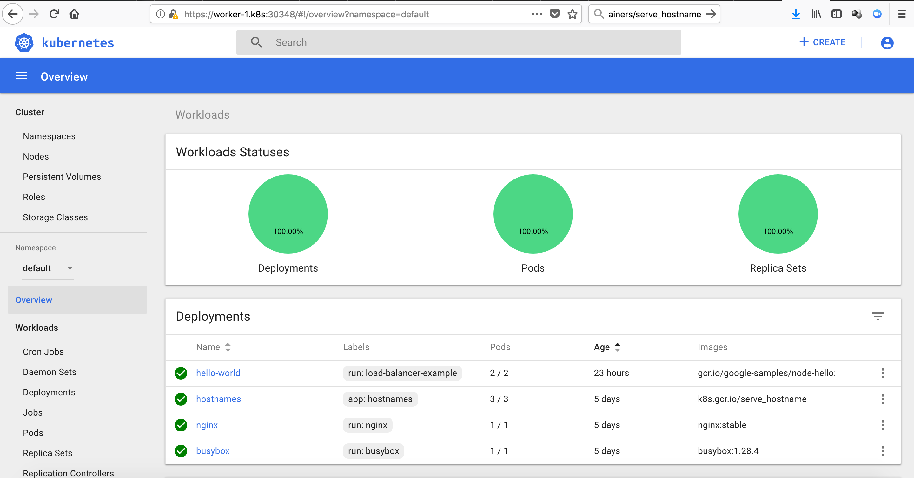

# kubernetes-the-ansible-way
[](https://travis-ci.org/jonashackt/kubernetes-the-ansible-way)
[](https://github.com/jonashackt/kubernetes-the-ansible-way/blob/master/LICENSE)
[]()
[]()
[]()
[]()
[]()
[]()

Bootstrap Kubernetes the Ansible way on Everything (here: Vagrant). Inspired by [Kelsey Hightower´s kubernetes-the-hard-way](https://github.com/kelseyhightower/kubernetes-the-hard-way), but refactored to Infrastructure-as-Code. 

But we wanted to focus on different aspects:

* __No__ Google Cloud Platform fixation - open for many infrastructures
* Implement the concept of __[Infrastructure-as-Code](https://en.wikipedia.org/wiki/Infrastructure_as_Code)__, so that... 
* ...all the moving parts of Kubernetes will be __much more controllable & manageable__ 
* and the whole setup will be much more comprehensible
* A more modular setup, where things that relate to one topic (e.g. the Kubernetes master nodes), will be handled where they belong to

The origin of this repository was set by a team of [Johannes Barop](https://github.com/jbarop), [Frank Stibane](https://github.com/f-stibane), [Jan Müller](https://github.com/devpie), [Akhlaq Malik](https://github.com/imalik8088) & [Jonas Hecht](https://github.com/jonashackt) on a Kubernetes workshop in the [codecentric](https://github.com/codecentric)  Finca Mallorca in June 2018.


## Prerequisites

Install [Ansible](https://www.ansible.com/), [Vagrant](https://www.vagrantup.com/) and the following Plugins:
 
* [vagrant-dns](https://github.com/BerlinVagrant/vagrant-dns)
* [vagrant-vbguest](https://github.com/dotless-de/vagrant-vbguest)

And then run `vagrant dns --install`. Check, if the domain `.k8s` was registered correctly with:

```
scutil --dns
```

__Alternatively__, use the following scripts depending on your Host´s platform:


```bash
bash prepare.mac.bash
#or
bash prepare.arch.bash
```

Then do the usual:

```bash
vagrant up
```

And check, if you can reach a node:

```
dscacheutil -q host -a name master-0.k8s
```

This setup heavily relies on the Vagrant DNS plugin: https://github.com/BerlinVagrant/vagrant-dns

##### Vagrant DNS howitworks: TODO

# Glossar


Good introduction: https://www.baeldung.com/kubernetes (german)

* Calico https://www.projectcalico.org/
* CNI Container Network Interface
* etcd Distributed reliable key-value store for the most critical data of a distributed system
* [kube-apiserver][https://kubernetes.io/docs/concepts/overview/components/]: Component on the master that exposes the Kubernetes API
* kube-scheduler: Component on the master that watches newly created pods, selects node to run on
* kube-controller-manager: Component on the master that runs controllers
* kubelet: An agent that runs on each node in the cluster. It makes sure that containers are running in a pod
* kube-proxy: enables the Kubernetes service abstraction by maintaining network rules on the host and performing connection forwarding.

# containerd

see https://blog.docker.com/2017/08/what-is-containerd-runtime/


https://kubernetes.io/blog/2018/05/24/kubernetes-containerd-integration-goes-ga/

# Networking

https://prefetch.net/blog/2018/01/20/generating-kubernetes-pod-cidr-routes-with-ansible/

### CNI - Container Network Intercafe

"CNI (Container Network Interface), a Cloud Native Computing Foundation project, consists of a specification and libraries for writing plugins to configure network interfaces in Linux containers, along with a number of supported plugins."

https://github.com/containernetworking/cni

Which CNI-Provider to choose:

https://chrislovecnm.com/kubernetes/cni/choosing-a-cni-provider/

### Flannel

"flannel is a virtual network that attaches IP addresses to containers" 

https://coreos.com/flannel/docs/latest/kubernetes.html


"The network in the flannel configuration should match the pod network CIDR."

flannel will be deployed to worker: " deploy the flannel pod on each Node"

##### Flannel with Kubernetes on Vagrant

Trouble: https://github.com/coreos/flannel/blob/master/Documentation/troubleshooting.md#vagrant

> Vagrant typically assigns two interfaces to all VMs. The first, for which all hosts are assigned the IP address 10.0.2.15, is for external traffic that gets NATed.
  
  This may lead to problems with flannel. By default, flannel selects the first interface on a host. This leads to all hosts thinking they have the same public IP address. To prevent this issue, pass the --iface eth1 flag to flannel so that the second interface is chosen.

Solution: https://stackoverflow.com/a/48755233/4964553, add the following line:

```
  - --iface=enp0s8
```

in https://raw.githubusercontent.com/coreos/flannel/master/Documentation/kube-flannel.yml

##### Flannel with Docker

This is a good overview (from https://blog.laputa.io/kubernetes-flannel-networking-6a1cb1f8ec7c):


To achieve this, we need to install flanneld and then set the following inside the `docker.service.j2`:

```
EnvironmentFile=/run/flannel/subnet.env
ExecStart=/usr/bin/dockerd \
    --bip=${FLANNEL_SUBNET} \
    --mtu=${FLANNEL_MTU} \
    --iptables=false \
    --ip-masq=false \
    --ip-forward=true \
    -H fd://
```
See the following links: 

* https://kubernetes.io/docs/setup/scratch/#docker
* https://docs.docker.com/install/linux/linux-postinstall/#configuring-remote-access-with-systemd-unit-file
* https://coreos.com/flannel/docs/latest/flannel-config.html
* https://icicimov.github.io/blog/kubernetes/Kubernetes-cluster-step-by-step-Part4/

##### Kubernetes DNS (kube-dns)

Debug Service DNS: https://kubernetes.io/docs/tasks/debug-application-cluster/debug-service/#does-the-service-work-by-ip

Really helpful from this article -> the kubernetes test [hostnames image](https://github.com/kubernetes/kubernetes/tree/master/test/images/serve-hostname):

```
kubectl run hostnames --image=k8s.gcr.io/serve_hostname \
                        --labels=app=hostnames \
                        --port=9376 \
                        --replicas=3
kubectl expose deployment hostnames --port=80 --target-port=9376
```

Debug kube-dns: https://kubernetes.io/docs/tasks/administer-cluster/dns-debugging-resolution/

https://kubernetes.io/docs/concepts/services-networking/dns-pod-service/:

> Kubernetes DNS schedules a DNS Pod and Service on the cluster, and configures the kubelets to tell individual containers to use the DNS Service’s IP to resolve DNS names.


###### nslookup for kubernetes not working in kubedns / main.yml

We set `--ip-masq=false` inside the `docker.service`. The problem is

```
vagrant@master-0:~$ kubectl exec -i busybox-68654f944b-rgk5q -- nslookup kubernetes
Server:    10.32.0.10
```

We need to add the following to the `flannel.service.j2` (kubeadm had the problem also https://github.com/kubernetes/kubernetes/issues/45459):

```
  -ip-masq
```

NOW the nslookup finally works:

```
vagrant@master-0:~$ kubectl exec -i busybox-68654f944b-rgk5q -- nslookup kubernetes
Server:    10.32.0.10
Address 1: 10.32.0.10 kube-dns.kube-system.svc.cluster.local

Name:      kubernetes
Address 1: 10.32.0.1 kubernetes.default.svc.cluster.local
```

###### if nslookup still doesnt work - "If the outer resolv.conf points to 127.0.0.1:53, then you will have a DNS lookup loop"

The problem is node DNS configuration inheritance! See https://kubernetes.io/docs/tasks/administer-cluster/dns-custom-nameservers/#inheriting-dns-from-the-node

> When running a Pod, kubelet prepends the cluster DNS server and searches paths to the node’s DNS settings. If you don’t want this, or if you want a different DNS config for pods, you can use the kubelet’s --resolv-conf flag. Set this flag to “” to prevent Pods from inheriting DNS. 

Also see https://github.com/kubernetes/kubernetes/issues/49411#issuecomment-318096636

> Kubedns inherits the contents of “/etc/resolv.conf” something the maintainers of these pods should document at the following site (https://github.com/kubernetes/kubernetes/tree/master/cluster/addons/dns ) as it takes a lot of research and googling to find such details hidden under forum comments. My two cents

check your Ubuntu boxes `cat /etc/resolve.conf`: 

```
nameserver 127.0.0.53
```

> systemd-resolved on my host listens on 127.0.0.53:53 for dns queries, as soon as I uninstall systemd-resolved and install dnsmasq my node has an entry of 127.0.0.1 in /etc/resolv.conf instead of 127.0.0.53, this gets inherited by the kubedns pods and for some reason its able to forward unresolved queries to my host dnsmasq. Earlier, the kubedns inherited the 127.0.0.53 IP from node “/etc/resolv.conf” and for some reason its not able to talk to the node systemd-resolved at that IP.


__Solution:__

See https://askubuntu.com/a/974482/451114 & https://askubuntu.com/questions/952284/dns-system-is-failing-to-resolve-domain-names-occasionally#comment1589832_952284

```
sudo mv /etc/resolv.conf /etc/resolv.conf_orig
sudo ln -s /run/systemd/resolve/resolv.conf /etc/resolv.conf
```

Now `cat /etc/resolve.conf` should inherit the correct nameserver (VirtualBox DNS server):

```
nameserver 10.0.2.3
```

See https://stackoverflow.com/questions/45246147/kubernetes-kubedns-sidecar-and-masq-crashes-if-i-do-a-nslookup/52036125#52036125

###### Busybox seems to have nslookup problems

You won´t believe it: But the latest busybox image isn´t able to do a proper `nslookup`:

https://github.com/kubernetes/kubernetes/issues/45479
https://github.com/kubernetes/kubernetes/issues/66924
https://github.com/docker-library/busybox/issues/48
https://github.com/kelseyhightower/kubernetes-the-hard-way/issues/356
https://stackoverflow.com/a/52036125/4964553


## Dashboard

> First thing important: Kubernetes and Dashboard versions need to be compatible! See https://github.com/kubernetes/dashboard/wiki/Compatibility-matrix

https://kubernetes.io/docs/tasks/access-application-cluster/web-ui-dashboard/

Installation: https://github.com/kubernetes/dashboard/wiki/Installation#recommended-setup (don´t use kubectl proxy!)

Access: Through API-Server: https://github.com/kubernetes/dashboard/wiki/Accessing-Dashboard---1.6.X-and-below#api-server

> In case Kubernetes API server is exposed and accessible from outside you can directly access dashboard at: 

```
https://external.k8s:6443/api/v1/namespaces/kube-system/services/https:kubernetes-dashboard:/proxy/#!/login
```

Grant Dashboard Admin-Rights: https://github.com/kubernetes/dashboard/wiki/Access-control#admin-privileges

> Make sure that you know what you are doing before proceeding. Granting admin privileges to Dashboard's Service Account might be a security risk.

And the dashboard could´nt be accesses right away, only manually by Johannes with a port forwarding and tiller-deployment to retrieve the Token (key didn´t work).

Usage of Dashboard is described here: https://kubernetes.io/docs/tasks/access-application-cluster/web-ui-dashboard/


#### Accessing k8s resources (like the Dashboard)

General docs for k8s service access: https://kubernetes.io/docs/tasks/administer-cluster/access-cluster-services/

> Be sure to know the [service publishing types](https://kubernetes.io/docs/concepts/services-networking/service/#publishing-services-service-types), especially `ClusterIP`, `NodePort`, `Loadbalancer`

Also have a look on how Services are accessing Pods - and are itself accessed by the kube-apiserver: https://kubernetes.io/docs/concepts/services-networking/service/#proxy-mode-iptables

If you´re using [Proxy-mode: iptables](https://kubernetes.io/docs/concepts/services-networking/service/#proxy-mode-iptables) like in this example here, then this looks like:


###### Configure kubectl to access our k8s cluster

If you want to interact with your k8s cluster, you need to setup your CLI for the specific cluster (`config set-cluster`), user (`config set-credentials`) and context (`config set-context`). All three are applied by a subsequent `config use-context`. For our `kubernetes-the-ansible-way` cluster, using the `admin` user, this is the following:

```
kubectl config set-cluster kubernetes-the-ansible-way \
      --certificate-authority=certificates/ca.pem \
      --embed-certs=true \
      --server=https://external.k8s:6443

kubectl config set-credentials admin \
      --client-certificate=certificates/admin.pem \
      --client-key=certificates/admin-key.pem

kubectl config set-context cluster-access \
      --cluster=kubernetes-the-ansible-way \
      --user=admin

kubectl config use-context cluster-access
```

Review the successful configuration by a `kubectl cluster-info`. This should give something like:

```
$ kubectl cluster-info
Kubernetes master is running at https://external.k8s:6443
KubeDNS is running at https://external.k8s:6443/api/v1/namespaces/kube-system/services/kube-dns:dns/proxy

To further debug and diagnose cluster problems, use 'kubectl cluster-info dump'.
```

or have a look at your configuration with `kubectl config view` (see https://kubernetes.io/docs/tasks/access-application-cluster/access-cluster/#accessing-for-the-first-time-with-kubectl).

> Keep in mind, that a Kubernetes context is a triple out of cluster(name), user(name) & namespace. [See the docs](https://kubernetes.io/docs/tasks/access-application-cluster/configure-access-multiple-clusters/#define-clusters-users-and-contexts)


###### Authentication

See https://kubernetes.io/docs/reference/access-authn-authz/authentication/. 

We always (regardless which access we want to do to our k8s cluster) need to authenticate against the `kube-apiserver`. This can be done through many ways, one is to use a [Bearer Token](https://github.com/kubernetes/dashboard/wiki/Creating-sample-user#bearer-token) inside the Request. Extract the Token with:

```
kubectl -n kube-system describe secret $(kubectl -n kube-system get secret | grep YourDashboardUserHere | awk '{print $1}')
```

or

```
kubectl -n kube-system get secret
kubectl -n kube-system describe secret kubernetes-dashboard-token-7pxdg
```

This gives something like:

```
Name:         kubernetes-dashboard-token-7pxdg
Namespace:    kube-system
Labels:       <none>
Annotations:  kubernetes.io/service-account.name=kubernetes-dashboard
              kubernetes.io/service-account.uid=b7a7d00e-acfe-11e8-9ce0-027a2f310a05

Type:  kubernetes.io/service-account-token

Data
====
ca.crt:     1314 bytes
namespace:  11 bytes
token:      fooBarYourTokenHere
```

Now use your Token `fooBarYourTokenHere` within a HTTP request to `https://external.k8s:6443/api/v1/namespaces/kube-system/services/https:kubernetes-dashboard:/proxy/`.

If not, you´ll see a message like this:

```
{
    "kind": "Status",
    "apiVersion": "v1",
    "metadata": {},
    "status": "Failure",
    "message": "services \"https:kubernetes-dashboard:\" is forbidden: User \"system:anonymous\" cannot get services/proxy in the namespace \"kube-system\"",
    "reason": "Forbidden",
    "details": {
        "name": "https:kubernetes-dashboard:",
        "kind": "services"
    },
    "code": 403
}
```


###### Authorization

See https://kubernetes.io/docs/reference/access-authn-authz/authorization/

kubernetes-the-hard-way configure Node and RBAC authorization modules. [RBAC is defined as](https://kubernetes.io/docs/reference/access-authn-authz/authorization/#authorization-modules):

> RBAC - Role-based access control (RBAC) is a method of regulating access to computer or network resources based on the roles of individual users within an enterprise

For configuring a Dashboard user, see https://github.com/kubernetes/dashboard/wiki/Creating-sample-user#bearer-token

###### Access Dashboard directly on worker-nodes

As we deployed Dashboard with `NodePort`, run `kubectl get services -n kube-system` to get the NodePort of your Dashboard Service:

```
vagrant@master-0:/$ kubectl get services -n kube-system
NAME                   TYPE        CLUSTER-IP    EXTERNAL-IP   PORT(S)         AGE
kube-dns               ClusterIP   10.32.0.10    <none>        53/UDP,53/TCP   5d
kubernetes-dashboard   NodePort    10.32.0.242   <none>        443:30348/TCP   5d
```

Now enter the following URL into your Browser and accept the SecurityExceptions: `https://worker-1.k8s:30348` (regardless which worker)

Extract the Dashboard Bearer Token with:

```
kubectl -n kube-system get secret
kubectl -n kube-system describe secret kubernetes-dashboard-token-7pxdg
```

and paste the Token into the provided field of the Loginscreen. Now you should see the Dashboard:



#### Access a k8s cluster app (pod) through a Service

https://kubernetes.io/docs/tasks/access-application-cluster/service-access-application-cluster/

```
kubectl run hello-world --replicas=2 --labels="run=load-balancer-example" --image=gcr.io/google-samples/node-hello:1.0  --port=8080

kubectl expose deployment hello-world --type=NodePort --name=hello-world-service
```

## Helm

Install Helm / Tiller: https://docs.helm.sh/using_helm/

#### Helm client

Mac: `brew install kubernetes-helm`

Windows: `choco install kubernetes-helm`

#### Helm server (Tiller)

https://docs.helm.sh/using_helm/#installing-tiller

The role [helm-tiller](/roles/helm-tiller/tasks/main.yml) takes care of the installation:

```bash
- name: Install Helm
  shell: snap install helm

- name: Ensure helm directory exists
  file:
    path: /root/snap/helm/common/kube/
    state: directory

- name: Copy kubeconfig for Tiller
  copy:
    src: /vagrant/configurationfiles/admin.kubeconfig
    dest: /root/snap/helm/common/kube/config
    remote_src: yes

- name: Install Tiller
  shell: helm init

- name: Verify, if Tiller was installed
  shell: kubectl get pods --namespace kube-system -l name=tiller
  register: kubectl_kube_system_pods
  until: kubectl_kube_system_pods.stdout.find("Running") != -1
  retries: 5
  delay: 10
```


## Commands

```bash

ansible --private-key=$(pwd)/.vagrant/machines/client-0/virtualbox/private_key client -i hosts -u vagrant -m setup

# kube api server health checks
curl --cacert certificates/ca.pem --key certificates/admin-key.pem --cert certificates/admin.pem https://client-0.k8s:6443/healthz

```

## Links

  * [kubectl cheatsheet][0] 
  * [Exam Experience][1] 
  * [K8s from scratch by offical documentation][2] 
  * [Google Document by codecentric K8s GERMAN Team][3] 
  * [kubernetes by example][4] 
  * [Best practice by google][5] 
  * [Tutorialspoint][6] 
  * Tutorials: https://kubernetes.io/docs/tutorials/kubernetes-basics/explore/explore-intro/


[0]: https://kubernetes.io/docs/reference/kubectl/cheatsheet/
[1]: https://medium.com/@jnowakowski/k8s-admin-exam-tips-22961241ba7d
[2]: https://kubernetes.io/docs/setup/scratch/#designing-and-preparing
[3]: https://docs.google.com/document/u/2/d/1nAQQNjoPzpzvZZhJk0wyKBqz9udgYZjzJgeRAjo6vU4/edit?usp=sharing
[4]: http://kubernetesbyexample.com/
[5]: https://medium.com/google-cloud/kubernetes-best-practices-season-one-11119aee1d10
[6]: https://www.tutorialspoint.com/kubernetes/index.htm